<div align="center">

# Uzdevumi

**Uzdevumu pārvaldnieks ar Kanban dēli, kalendāru, soļiem, pielikumiem, kopīgošanu, komentāriem un 🔥 sērijām.**
PHP + MySQL, MVC arhitektūra bez ietvara.


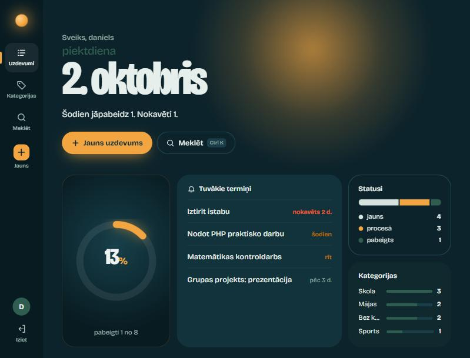

</div>

---

## Saturs

- [Funkcijas](#funkcijas)
- [Ekrānuzņēmumi](#ekrānuzņēmumi)
- [Palaišana](#palaišana)
- [Demo dati](#demo-dati)
- [Projekta struktūra](#projekta-struktūra)
- [Kā tas darbojas](#kā-tas-darbojas)
- [Datubāze](#datubāze)
- [Maršruti](#maršruti)
- [Drošība](#drošība)
- [Testēšana](#testēšana)
- [Praktiskā darba prasības](#praktiskā-darba-prasības)
- [Autori](#autori)

---

## Funkcijas

| | Funkcija | Apraksts |
|---|---|---|
| 🔐 | **Konti** | Reģistrācija, pieteikšanās, atteikšanās. Paroles glabātas kā bcrypt jaucējvērtības. |
| 👤 | **Profils** | Statistika, sērija, paroles maiņa un konta dzēšana (ar paroles apstiprinājumu). |
| ✅ | **Uzdevumi (CRUD)** | Izveidot, skatīt, rediģēt, dzēst. Statuss, termiņš, kategorija, apraksts. |
| 🔥 | **Prioritāte** | Zema / vidēja / augsta. Krāsaina mala sarakstā, kārtošana pēc prioritātes. |
| 🪜 | **Soļi** | Uzdevumu var sadalīt mazākos soļos, atzīmēt tos un redzēt progresu. |
| 🔗 | **Saites** | Pievieno lapas, attēlus vai YouTube video. Attēliem un video redzams priekšskatījums. |
| 👥 | **Kopīgošana** | Kopīgo uzdevumu ar citu lietotāju pēc vārda. Viņš to redz un var papildināt soļus, saites, failus un komentārus. |
| 💬 | **Aktivitāte un komentāri** | Katram uzdevumam ir laika josla: kurš ko mainīja (statuss, soļi, faili, termiņš) un komentāri. |
| 📎 | **Pielikumi** | PDF, attēli, Word, Excel, PowerPoint, TXT, ZIP līdz 5 MB. Attēliem sīktēli, failus var ievilkt. |
| 🔁 | **Atkārtoti uzdevumi** | Katru dienu / nedēļu / mēnesi. Pabeidzot izveidojas nākamais ar jaunu termiņu un soļiem. |
| 🗂️ | **Kanban dēlis** | Trīs kolonnas. Kartītes pārvelk ar peli vai pirkstu, ar tastatūru - ar bultiņu pogām. |
| 📅 | **Kalendārs** | Mēneša skats ar uzdevumiem termiņu dienās. Pārvelc uzdevumu uz citu dienu, lai mainītu termiņu. |
| 🟧 | **Aktivitātes karte un sērija** | GitHub stila karte ar pabeigtajiem uzdevumiem pa dienām un 🔥 sērija (dienas pēc kārtas). |
| 🎉 | **Konfeti un skaņa** | Pabeidzot uzdevumu, lido konfeti un skan īsa melodija. Skaņu var izslēgt profilā. |
| 🔎 | **Meklēšana** | Meklēšana serverī pēc nosaukuma un apraksta + ātrais meklēšanas logs (`Ctrl+K` vai `/`). |
| 🔔 | **Atgādinājumi** | Paziņojumi par uzdevumiem, kuru termiņš ir šodien, rīt vai jau nokavēts. |
| 📊 | **Logrīki** | Pabeigto procents, tuvākie termiņi, statusu sadalījums, kategorijas. |
| 🏷️ | **Kategorijas** | Savas kategorijas ar uzdevumu skaitu, pārdēvēšana, dzēšana. |
| 🌗 | **Gaišs un tumšs izskats** | Pēc sistēmas iestatījuma vai izvēlēts profilā. Pielāgots telefonam. |
| ⌨️ | **Tastatūra** | `N` - jauns uzdevums, `Ctrl+K` vai `/` - meklēšana, `Ctrl+Enter` - nosūtīt komentāru. |
| ⚡ | **Bez pārlādes** | Visas izmaiņas saglabājas fonā - lapa netiek pārlādēta. |
| 🛠️ | **Datubāzes sagatavošana** | Ja datubāzes nav, lietotne to izveido ar vienu klikšķi (arī ar demo datiem). |
| 📝 | **Žurnāls** | Katra darbība tiek ierakstīta `logs/actions.log`. |

---

## Ekrānuzņēmumi

<table>
<tr>
<td>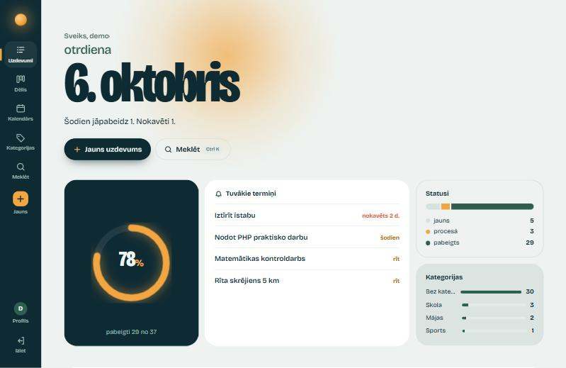</td>
<td>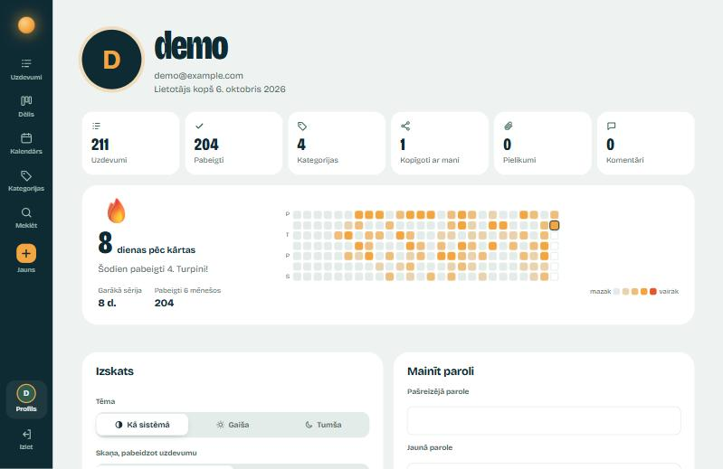</td>
</tr>
<tr>
<td align="center">Sākumlapa gaišajā izskatā</td>
<td align="center">Profils ar statistiku un sēriju</td>
</tr>
<tr>
<td>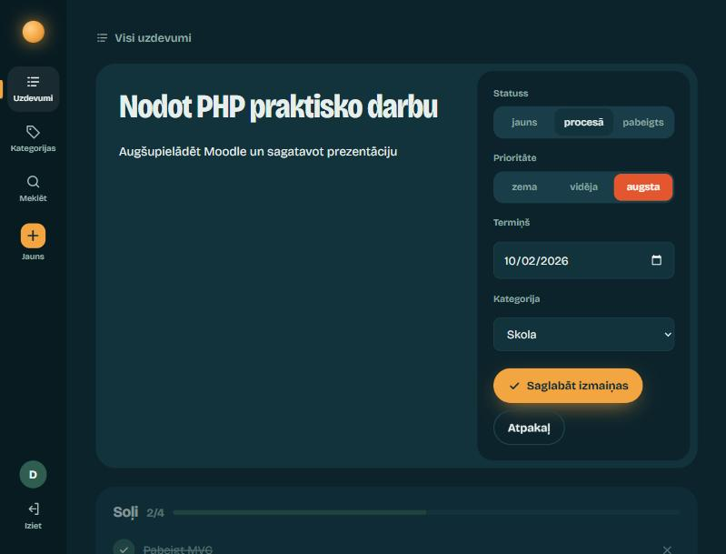</td>
<td>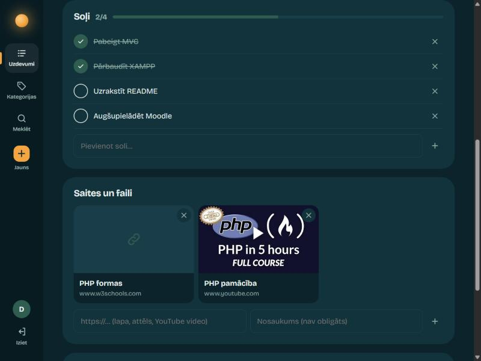</td>
</tr>
<tr>
<td align="center">Rediģēšana: statuss, prioritāte, termiņš</td>
<td align="center">Soļi ar progresu un saites ar priekšskatījumu</td>
</tr>
<tr>
<td>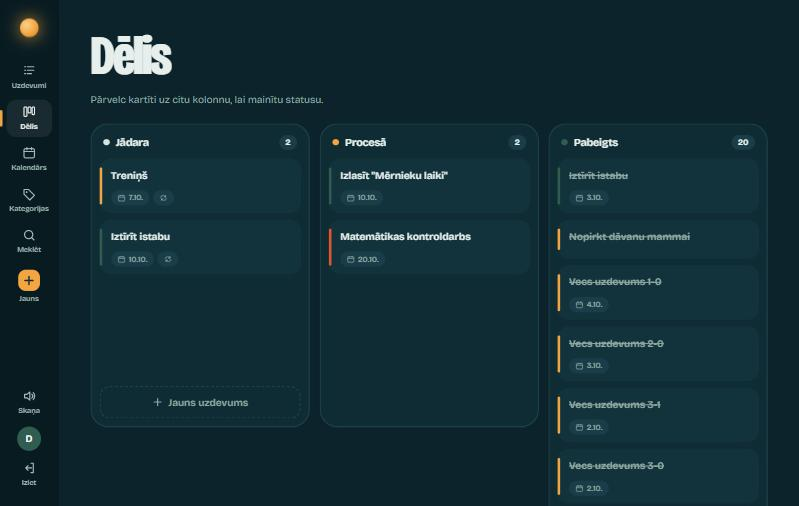</td>
<td>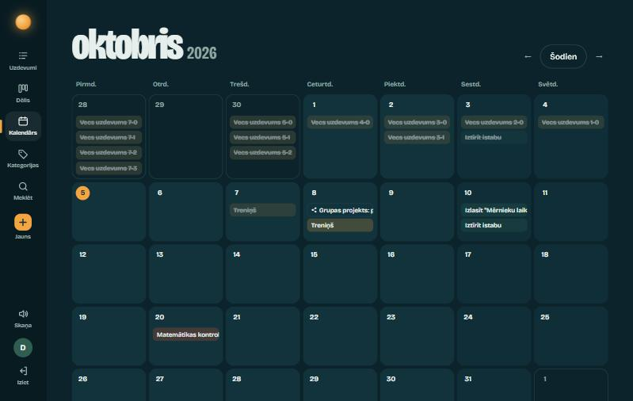</td>
</tr>
<tr>
<td align="center">Kanban dēlis ar pārvilkšanu</td>
<td align="center">Mēneša kalendārs</td>
</tr>
<tr>
<td>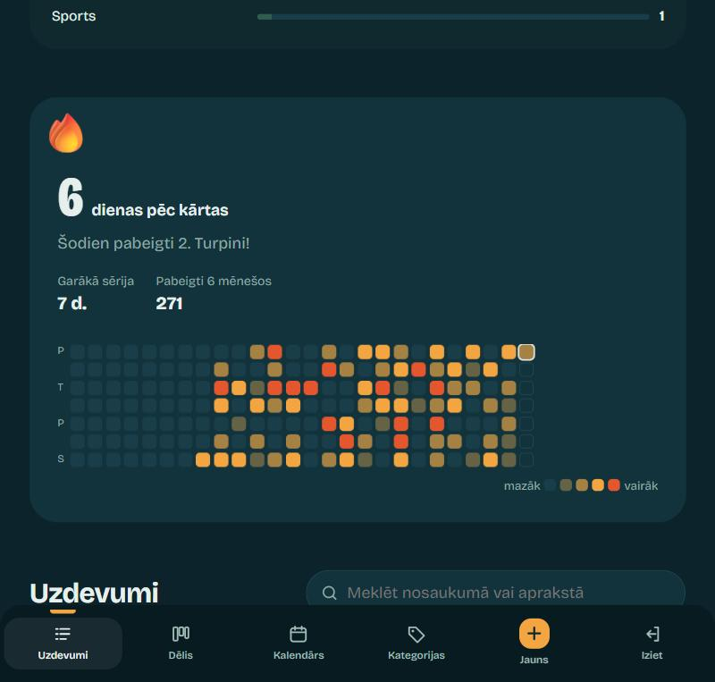</td>
<td>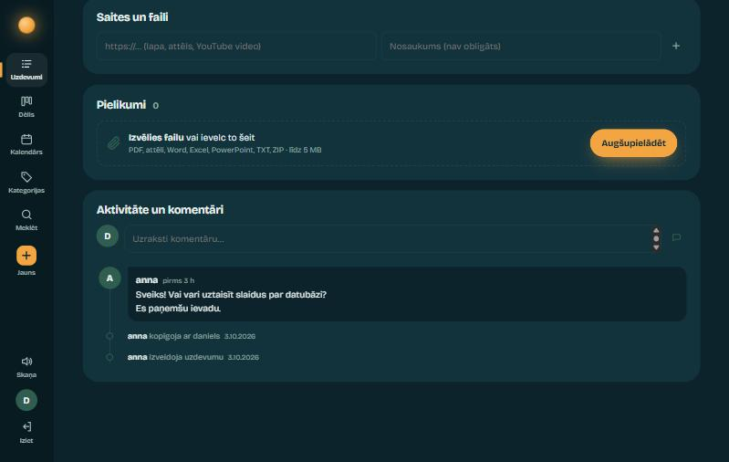</td>
</tr>
<tr>
<td align="center">Sērija un aktivitātes karte (telefonā)</td>
<td align="center">Pielikumi, aktivitāte un komentāri</td>
</tr>
</table>

---

## Palaišana

### Nepieciešams

- [XAMPP](https://www.apachefriends.org) (Apache + PHP 8.1 vai jaunāks + MySQL/MariaDB)

### Soļi

1. **Nokopē projektu** uz `C:\xampp\htdocs\`:
   ```bash
   cd C:\xampp\htdocs
   git clone https://github.com/Ne1tro-cpu/Task_Tracker.git
   ```
   vai vienkārši iekopē mapi `Task_Tracker` tur.

2. **Palaid serverus.** XAMPP Control Panel → **Start** pie **Apache** un **MySQL**.

3. **Atver lietotni:** <http://localhost/Task_Tracker/>

   Ja datubāzes vēl nav, atvērsies **sagatavošanas lapa** - nospied **Izveidot datubāzi**
   (pēc izvēles ar demo datiem). Lietotne izveidos datubāzi `Task_Tracker_db` un visas tabulas no
   [`database/schema.sql`](database/schema.sql).

4. **Izveido kontu** un piesakies (vai izmanto [demo kontus](#demo-dati)).

> Datubāzi var izveidot arī pašam: <http://localhost/phpmyadmin> → cilne **SQL** → ielīmē `database/schema.sql` saturu → **Go**.

### Iestatījumi

Failā [`config/config.php`](config/config.php):

```php
const DB_DSN    = 'mysql:host=localhost;dbname=Task_Tracker_db;charset=utf8mb4';
const DB_USER   = 'root';
const DB_PASS   = '';
const APP_DEBUG = false;   // true - kļūdas lapā redzamas detaļas (tikai izstrādei!)
```

### Problēmas

Lielāko daļu problēmu lietotne paskaidro pati - kļūdas lapā rakstīts, kas jāpārbauda.

| Problēma | Risinājums |
|---|---|
| Apache nestartē | Ports 80 aizņemts (Skype, IIS). XAMPP → Apache → Config → `httpd.conf`: `Listen 8080`, tad atver `localhost:8080/Task_Tracker/` |
| "Neizdevās pieslēgties MySQL serverim" | XAMPP Control Panel nav palaists MySQL |
| "MySQL nepieņēma lietotājvārdu vai paroli" | Pārbaudi `DB_USER` un `DB_PASS` failā `config/config.php` |
| "Class finfo not found" | `php.ini` atkomentē `extension=fileinfo` (XAMPP tas ir ieslēgts pēc noklusējuma) |
| Lielu failu augšupielāde neizdodas | `php.ini`: `upload_max_filesize` un `post_max_size` jābūt vismaz `6M` |
| Kas notika? | Skaties `logs/actions.log` - tur ierakstīta katra kļūda ar sākotnējo iemeslu |

---

## Demo dati

Sagatavošanas lapā atzīmējot **Pievienot demo datus**, tiek izveidoti divi konti:

| Lietotājs | Parole | Kas tur ir |
|---|---|---|
| `demo` | `demo1234` | 8 uzdevumi ar soļiem, saitēm un atkārtošanos, 4 kategorijas, 5 mēnešu vēsture aktivitātes kartei |
| `anna` | `anna1234` | Grupas projekts ar komentāru, kas kopīgots ar `demo` |

> ⚠️ Demo konti ir tikai lokālai demonstrācijai - publiskā serverī tos neveido.

---

## Projekta struktūra

```
uzdevumi/
├── index.php                  # Front controller + maršrutētājs
├── config/config.php          # DB pieslēgums un konstantes
├── database/
│   ├── schema.sql             # Pilna datubāzes izveide
├── app/
│   ├── core/                  # Karkass
│   │   ├── Database.php       #   PDO savienojums
│   │   ├── DatabaseException.php # saprotams skaidrojums datubāzes kļūdām
│   │   ├── ErrorHandler.php   #   kļūdu apstrāde un žurnāls
│   │   ├── Model.php          #   Bāzes modelis
│   │   ├── Controller.php     #   view(), redirect(), requireLogin(), requireTaskAccess() ...
│   │   └── helpers.php        #   e(), CSRF, write_log(), flash(), datumi latviski
│   ├── models/                # M — SQL vaicājumi, validācija un aprēķini
│   │   ├── User.php           #   konti, paroles, statistika, konta dzēšana
│   │   ├── Task.php           #   uzdevumi, atkārtošana, kopsavilkums, aktivitātes karte
│   │   ├── Category.php
│   │   ├── Subtask.php
│   │   ├── TaskLink.php
│   │   ├── TaskShare.php
│   │   ├── TaskFile.php       #   pielikumi (pārbaude + saglabāšana)
│   │   ├── Activity.php       #   aktivitāte un komentāri
│   │   ├── LoginAttempt.php
│   │   └── Setup.php          #   datubāzes izveide, atjaunināšana, demo dati
│   ├── controllers/           # C — pieprasījuma apstrāde
│   │   ├── AuthController.php
│   │   ├── TaskController.php #   CRUD + statuss (dēlis) + termiņš (kalendārs)
│   │   ├── BoardController.php
│   │   ├── CalendarController.php
│   │   ├── CategoryController.php
│   │   ├── SubtaskController.php
│   │   ├── LinkController.php
│   │   ├── FileController.php
│   │   ├── CommentController.php
│   │   ├── ShareController.php
│   │   ├── ProfileController.php
│   │   └── SetupController.php
│   └── views/                 # V — HTML lapas (tikai attēlošana)
│       ├── layout/            #   header.php, footer.php
│       ├── partials/          #   streak.php (sērija + karte; sākumlapā un profilā)
│       ├── auth/              #   login, register, _scene
│       ├── tasks/             #   index (saraksts), form (redaktors + paneļi)
│       ├── board/  calendar/  categories/  profile/  setup/
│       └── error.php          #   kļūdu lapa (404, 403, 500 ...)
├── assets/
│   ├── style.css              # Viss noformējums un animācijas
│   └── app.js                 # Bez pārlādes, meklēšana, vilkšana, konfeti, tēma ...
├── tests/smoke.php            # Dūmu tests (87 pārbaudes caur HTTP)
├── docs/                      # Ekrānuzņēmumi README failam
├── logs/                      # actions.log (izveidojas automātiski)
└── uploads/                   # Pielikumi ar nejaušiem nosaukumiem (nav pieejami tieši)
```

Mapēm `app/`, `config/`, `database/`, `logs/`, `uploads/` un `tests/` ir `.htaccess` ar `Require all denied`,
tāpēc pārlūkā tās atvērt nevar. Publiski pieejams ir tikai `index.php` un `assets/`.
Ja `logs/` vai `uploads/` pazūd, lietotne tās izveido no jauna kopā ar `.htaccess`.

---

## Kā tas darbojas

### MVC

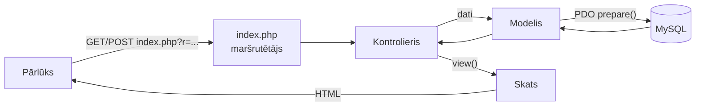

- **`index.php`** nolasa maršrutu (`?r=tasks/edit`) un HTTP metodi un pēc tabulas izsauc kontroliera metodi.
- **Kontrolieris** pārbauda pieteikšanos un CSRF kodu, nolasa formas datus un izsauc modeli.
- **Modelis** validē datus, izpilda parametrizētus SQL vaicājumus un aprēķina (piem., `Task::summary()`, `Task::heatmap()`).
- **Skats** saņem gatavus datus un izvada HTML - bez SQL un bez aprēķiniem.

### Piemērs: soļa pievienošana

1. Forma sūta `POST index.php?r=subtasks/create` ar `task_id` un `title`.
2. Maršrutētājs izsauc `SubtaskController::store()`.
3. Kontrolieris: `requireLogin()` → `check_csrf()` → `requireTaskAccess()` (vai uzdevums ir mans vai kopīgots ar mani).
4. `Subtask::validate()` pārbauda nosaukumu, `Subtask::create()` izpilda `INSERT`.
5. Aktivitātē un žurnālā tiek ierakstīts, kas notika; lietotājs tiek pāradresēts atpakaļ (Post/Redirect/Get).

### Piekļuves noteikumi

| Darbība | Īpašnieks | Kopīgots lietotājs |
|---|:---:|:---:|
| Redzēt uzdevumu sarakstā un atvērt | ✅ | ✅ |
| Rediģēt nosaukumu, statusu, termiņu u.c. | ✅ | ❌ |
| Dzēst uzdevumu | ✅ | ❌ |
| Pievienot / atzīmēt / dzēst soļus | ✅ | ✅ |
| Pievienot / noņemt saites | ✅ | ✅ |
| Pievienot / lejupielādēt / dzēst failus | ✅ | ✅ |
| Komentēt (dzēst var tikai savu komentāru) | ✅ | ✅ |
| Pārvietot uz dēļa vai kalendārā | ✅ | ❌ |
| Kopīgot ar citiem / pārtraukt kopīgošanu | ✅ | ❌ |

### Atkārtoti uzdevumi

Kad uzdevums ar atkārtošanos kļūst **pabeigts** (formā, ar ātro atzīmi vai uz dēļa), kontrolieris
**vienā transakcijā** saglabā statusu un izsauc `Task::spawnNext()`:

1. izveido kopiju ar statusu "jauns" un nākamo termiņu (`Task::nextDueDate()`):
   - termiņš vienmēr ir nākotnē - ja uzdevums pabeigts ar nokavēšanos, pagājušās reizes tiek izlaistas;
   - mēneša uzdevums, kura diena nākamajā mēnesī neeksistē (31.), pāriet uz mēneša pēdējo dienu;
2. nokopē soļus (neizpildītus);
3. vecajam uzdevumam noņem atkārtošanos, lai, to atverot un pabeidzot vēlreiz, nerastos dublikāti.

### Aktivitātes karte un sērija

Kad uzdevums kļūst pabeigts, tiek saglabāts `completed_at`. `Task::heatmap()` saskaita pabeigtos pa dienām
(`GROUP BY DATE(completed_at)`) un aprēķina **sēriju** (dienas pēc kārtas līdz šodienai ar vismaz 1 pabeigtu
uzdevumu), **garāko sēriju** un **kopējo skaitu** pēdējās 26 nedēļās.

### Izmaiņas bez lapas pārlādes

Visas formas strādā arī bez JavaScript (parasts POST → pāradresācija). Ar JavaScript `app.js` tās nosūta fonā:

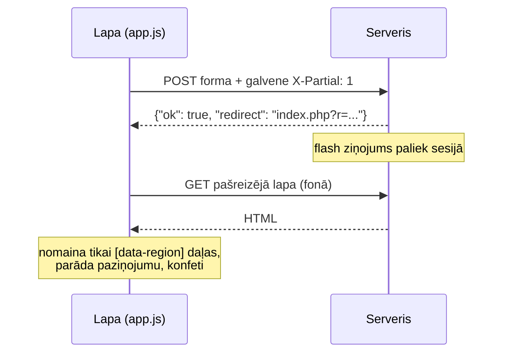

- `Controller::redirect()` - ja ir galvene `X-Partial: 1`, atbild ar JSON, nevis `Location:` pāradresāciju.
- Lapas daļas, kuras var nomainīt, ir atzīmētas ar `data-region`.
- Redaktors un paroles forma (`data-region-self`) tiek nomainīti tikai tad, ja saglabāja tieši tos - lai nepazustu teksts, ko raksti.
- Neiesniegts teksts citos laukos (piem., iesākts komentārs) un fokuss (`data-focus-id`) tiek saglabāti.
- Ja serveris pāradresē uz citu lapu (piem., pēc jauna uzdevuma izveides), pārlūks pāriet uz to.

Dēlis un kalendārs sūta `fetch()` ar galveni `X-Requested-With: fetch` un CSRF kodu no `<meta name="csrf-token">`;
kontrolieris atbild ar JSON datiem (`{"ok": true, "spawned": 42}`).

### Kļūdas un datubāzes sagatavošana

`ErrorHandler` pārvērš PHP brīdinājumus izņēmumos, ieraksta katru kļūdu žurnālā (ar sākotnējo MySQL kļūdu)
un parāda saprotamu lapu. `DatabaseException::fromPdo()` pēc MySQL kļūdas koda nosaka, kas noticis:

| MySQL kods | Nozīme | Ko redz lietotājs |
|---|---|---|
| 2002 | MySQL nav palaists | Kļūdas lapa: "palaid MySQL XAMPP Control Panel" |
| 1045 | Nepareiza parole | Kļūdas lapa: "pārbaudi `config.php`" |
| 1049 / 1146 | Nav datubāzes / tabulu | Sagatavošanas lapa: **Izveidot datubāzi** |
| 1054 | Trūkst kolonnu | Sagatavošanas lapa: **Atjaunināt datubāzi** |

`Setup` modelis no `information_schema` nosaka datubāzes stāvokli un izpilda tikai vajadzīgos SQL failus.
Kad datubāze ir gatava, sagatavošanas lapa vairs nav pieejama.

### Frontend

- **`style.css`** - krāsu tokeni (gaišais un tumšais izskats; teksta kontrasts ≥ 4.5:1), izkārtojums ar sānu joslu (telefonā apakšā), animācijas. Ievēro sistēmas iestatījumu "mazāk kustību".
- **`app.js`** - ērtības un efekti:
  - izmaiņas bez pārlādes, meklēšanas logs (`Ctrl+K` / `/`), taustiņš `N`;
  - termiņu atgādinājumi (aizvērtie tiek atcerēti līdz dienas beigām);
  - vilkšana ar peli vai pirkstu (Pointer Events) dēlim un kalendāram;
  - konfeti uz `<canvas>` un melodija ar Web Audio API (bez skaņas failiem);
  - tēma un skaņa (glabājas pārlūkā, `localStorage`);
  - lapu pārejas ar View Transitions API (Chrome/Edge).

---

## Datubāze

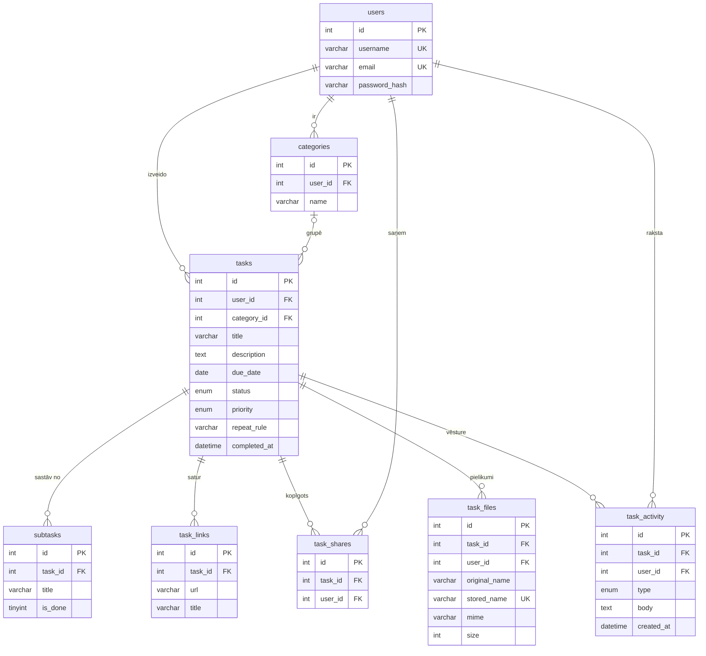

Papildus ir tabula `login_attempts` (IP, lietotājvārds, laiks) aizsardzībai pret paroļu minēšanu.

- Dzēšot **lietotāju** - izdzēšas viņa uzdevumi, kategorijas, kopīgošanas, komentāri un faili (arī no diska).
- Dzēšot **uzdevumu** - izdzēšas tā soļi, saites, pielikumi (arī no diska), aktivitāte un kopīgošanas.
- Dzēšot **kategoriju** - uzdevumi paliek, bet bez kategorijas (`ON DELETE SET NULL`).

Pārbaudīts ar MariaDB 10.4 (XAMPP) gan noklusējuma, gan stingrajā SQL režīmā (`ONLY_FULL_GROUP_BY`, `STRICT_TRANS_TABLES` - kā MySQL 8).

---

## Maršruti

| Metode | Maršruts | Kontrolieris → metode |
|---|---|---|
| `GET` `POST` | `register` | `AuthController` → `showRegister` / `register` |
| `GET` `POST` | `login` | `AuthController` → `showLogin` / `login` |
| `POST` | `logout` | `AuthController` → `logout` |
| `GET` | `tasks` `[&status=][&q=]` | `TaskController` → `index` |
| `GET` `POST` | `tasks/create` | `TaskController` → `create` / `store` |
| `GET` `POST` | `tasks/edit&id=N` | `TaskController` → `edit` / `update` |
| `POST` | `tasks/delete` | `TaskController` → `delete` |
| `POST` | `tasks/status` *(JSON)* | `TaskController` → `changeStatus` |
| `POST` | `tasks/due` *(JSON)* | `TaskController` → `changeDue` |
| `GET` | `board` | `BoardController` → `index` |
| `GET` | `calendar` `[&month=YYYY-MM]` | `CalendarController` → `index` |
| `GET` | `categories` | `CategoryController` → `index` |
| `POST` | `categories/create` · `/edit` · `/delete` | `CategoryController` → `store` / `update` / `delete` |
| `POST` | `subtasks/create` · `/toggle` · `/delete` | `SubtaskController` → `store` / `toggle` / `delete` |
| `POST` | `links/create` · `/delete` | `LinkController` → `store` / `delete` |
| `POST` | `shares/create` · `/delete` | `ShareController` → `store` / `delete` |
| `POST` | `files/upload` · `/delete` | `FileController` → `upload` / `delete` |
| `GET` | `files/download&id=N` | `FileController` → `download` |
| `POST` | `comments/create` · `/delete` | `CommentController` → `store` / `delete` |
| `GET` | `profile` | `ProfileController` → `index` |
| `POST` | `profile/password` · `profile/delete` | `ProfileController` → `changePassword` / `delete` |
| `GET` | `setup` | `SetupController` → `index` *(tikai, kad datubāze nav gatava)* |
| `POST` | `setup/install` · `setup/upgrade` | `SetupController` → `install` / `upgrade` |

`GET` tikai lasa datus, `POST` maina datus. Nepareiza metode → **405**, nezināms maršruts → **404** (kļūdas lapa).

---

## Drošība

| Draudi | Aizsardzība | Kur |
|---|---|---|
| SQL injekcija | Tikai parametrizēti vaicājumi (`prepare` + `execute`), `ATTR_EMULATE_PREPARES = false` | visi modeļi |
| XSS | Visa izvade caur `e()` = `htmlspecialchars`; saitēm atļauts tikai `http`/`https` | `helpers.php`, `TaskLink::validate()` |
| CSRF | Nejaušs kods (`random_bytes`) katrā formā, pārbaude ar `hash_equals`; pēc pieteikšanās - jauns kods | `check_csrf()` |
| Paroļu noplūde | `password_hash()` / `password_verify()` (bcrypt ar sāli), automātiska pārrēķināšana (`password_needs_rehash`) | `User.php` |
| Paroļu minēšana | 5 neveiksmīgi mēģinājumi 15 min no vienas IP → bloķēšana | `LoginAttempt.php` |
| Lietotājvārdu uzminēšana | Pieteikšanās atbilde aizņem vienādu laiku neatkarīgi no tā, vai lietotājs eksistē | `User::authenticate()` |
| Sesijas fiksācija | `session_regenerate_id(true)` pēc pieteikšanās un paroles maiņas; `session.use_strict_mode` | `AuthController`, `index.php` |
| Sesijas zādzība | Sīkdatne `HttpOnly` (JS to nevar nolasīt) un `SameSite=Lax` | `index.php` |
| Clickjacking | `X-Frame-Options: DENY`, kā arī `X-Content-Type-Options: nosniff`, `Referrer-Policy` | `index.php` |
| Nederīga ievade | Vadības simboli un nederīgs UTF-8 tiek izmesti; vienrindas laukos nav rindu pārnesumu | `Controller::input()` |
| Žurnāla viltošana | Rindu pārnesumi un atdalītājs `\|` lietotāja tekstā tiek aizstāti | `write_log()` |
| Kļūdu noplūde | Kļūdas tiek ierakstītas žurnālā, lietotājs redz tikai skaidrojumu (`APP_DEBUG = false`) | `ErrorHandler.php` |
| Svešu datu piekļuve | Katrs vaicājums pārbauda `user_id` vai kopīgošanu; citādi 404 | `requireTaskAccess()`, `requireTaskOwner()` |
| Izdzēsts konts | Citās pārlūkprogrammās atvērtās sesijas tiek pārtrauktas | `Controller::requireLogin()` |
| Failu noplūde | `.htaccess` aizliedz `app/`, `config/`, `database/`, `logs/`, `uploads/`, `tests/`; pazudušas mapes tiek izveidotas kopā ar `.htaccess` | `.htaccess`, `ensure_private_dir()` |
| Bīstami pielikumi | Paplašinājumu saraksts + īstā tipa pārbaude ar `finfo` (PHP fails ar `.png` nosaukumu tiek noraidīts), SVG nav atļauts, max 5 MB | `TaskFile::store()` |
| Ceļa manipulācija | Fails tiek saglabāts ar nejaušu nosaukumu; lietotāja dotais nosaukums tiek attīrīts un netiek izmantots ceļā | `TaskFile::store()` |
| Pielikumu piekļuve | Lejupielāde tikai caur kontrolieri ar piekļuves pārbaudi; `nosniff`, ne-attēli kā `attachment` | `FileController::download()` |

---

## Testēšana

[`tests/smoke.php`](tests/smoke.php) ir dūmu tests, kas caur HTTP pārbauda visu lietotni kā īsts lietotājs:
reģistrāciju, pieteikšanos, CRUD, kopīgošanas tiesības, pielikumus, dēli, kalendāru, atkārtošanu, profilu,
drošības galvenes, `.htaccess` aizsardzību un to, ka nevienā lapā nav PHP brīdinājumu (87 pārbaudes).

Lietotnei jābūt palaistai. Termināļa logā:

```bash
C:\xampp\php\php.exe tests\smoke.php http://localhost/Task_Tracker
```

Tests izveido divus pagaidu lietotājus un beigās tos izdzēš. Ar `--full` papildus pārbauda aizsardzību pret
paroļu minēšanu (pēc tam 15 minūtes no šī datora nevarēs pieteikties).

```
Profils
  OK    Profila lapa ar statistiku
  OK    Paroles maiņa ar nepareizu pašreizējo paroli tiek noraidīta
  ...
Izdevās: 87   Kļūdas: 0   Izlaisti: 0
```

---

## Praktiskā darba prasības

<details>
<summary><b>Pamatprasības</b></summary>

- [x] Datubāze ar ≥2 saistītām tabulām, viena glabā lietotājus — `users`, `categories`, `tasks`, `subtasks`, `task_links`, `task_shares`, `task_files`, `task_activity`
- [x] Reģistrēšanās un pieteikšanās — `AuthController`
- [x] CRUD pēc pieteikšanās — `TaskController` (+ kategorijas, soļi, saites, pielikumi, komentāri); arī lietotājiem: reģistrācija, profils, paroles maiņa, konta dzēšana
- [x] Ievaddatu validācija — modeļu `validate()` metodes + `Controller::input()`
- [x] Parametrizēti vaicājumi — PDO `prepare()` visur
- [x] Jaucējfunkcija parolēm — `password_hash()`
- [x] Atbilstošas HTTP metodes — maršrutu tabula `index.php`

</details>

<details>
<summary><b>Papildus prasības</b></summary>

- [x] Papildus tabulas — `categories`, `subtasks`, `task_links`, `task_shares`, `task_files`, `task_activity`, `login_attempts`
- [x] Sesija un atteikšanās — `$_SESSION`, `logout`
- [x] Aizsardzība pret CSRF — `check_csrf()`
- [x] Aizsardzība pret paroļu minēšanu — `LoginAttempt`
- [x] Darbību žurnālfails — `logs/actions.log`

</details>

---

## Autori

Projekts izveidots kā *Praktiskais darbs 1 — PHP. Formu apstrāde. Datubāzes.*

- **[Ne1tro](https://github.com/Ne1tro-cpu)** — kods(backend, database), projekta ideja un prasības, funkciju un dizaina virziens, testēšana XAMPP vidē.
- **[Claude Opus 5.5](https://www.anthropic.com/claude)** (Anthropic) — kods (frontend), dizains, testi un dokumentācija.
